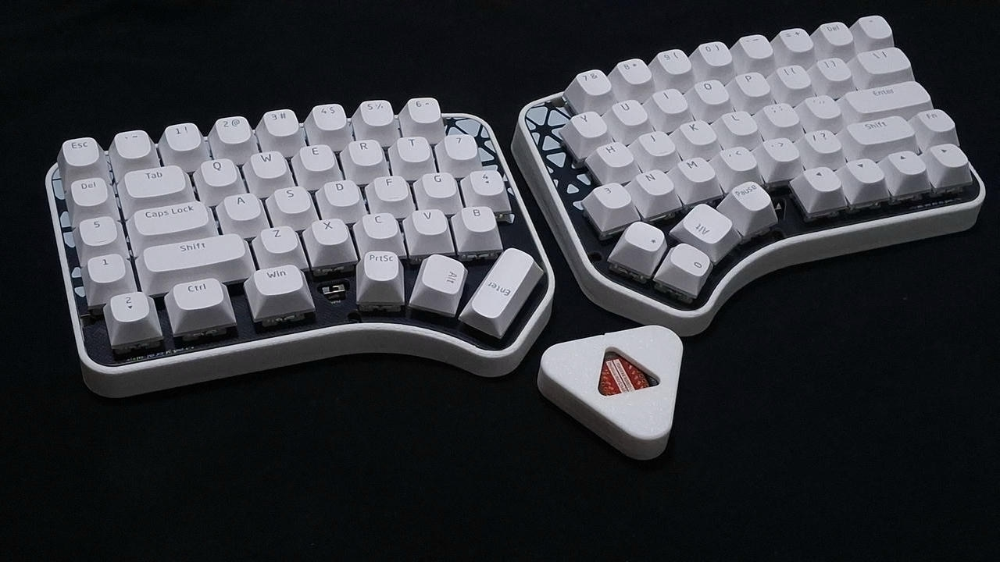

# yuwol
row staggered 60% hotswappable keyboard with reversible PCB, little ergo boost of [ilwol](https://github.com/yuburoll/ilwol)

The name yuwol is June in Korean.

This keyboard has additional Y/H/B keys which positioned between keyboards, and auxilary row at left outside. You may put the keycaps from numpad.

This keyboard has hotswap-only PCB.

yuwol can change layout to followings:

- Split left shift, to ISO shaped one.(2.25u to 1.25u/1u)

- Split right shift, to HHKB inspired shape.(2.75u to 1.75u/1u)

- Split outside thumb keys(2u to 1u/1u)

- Split backspace(2u to 1u/1u)

- Can use stepped caps lock

## Preparation

common:

- 2x yuwol PCB Boards, provided from the repo

- 1x printed case sets, 2 parts total, provided from the repo

- 1x 1.5-1.6T keyboard plate sets, 2 parts total, provided from the repo

- 80x diodes, normally 1N4148

- 84x Kailh hotswap sockets (or compatibles)

- 2x 4x4x1.5mm surface mount tact switches (optional, for dev boards without reset button)

- 1-6x PCB Mounted 2u Keyboard Stabilizers, normally 6

- 73-78x MX Keyswitches, normally 73

- 8x 10mm bumpon stickers

- A set of Keycaps, Full-size layout, ANSI preferred.

for wired build:

- 2x pro micro form factor dev board, with wireless chipset

- 2x USB-C 6 pin jack, top mount

- 1x USB-C data cable

- 10x M2x6 screws / or M2x3x3 heat inserts and M2x6 bolts

for wireless build:

- 2x pro micro form factor dev board

- 2x 523450 battery, with molex picoblade 1.25mm pitch, 2pin

- 2x molex picoblade 1.25mm pitch, 2pin

- 2x SS-12D00 switches

- 2x battery cover, provided from the repo

- 14x M2x6 screws / or M2x3x3 heat inserts and M2x6 bolts

## Differences between case variations

- Screw: 1.5 pi mounting holes for screw

- Insert: 3 pi mounting holes for heat insert

## Build Guides and Miscellaneous

[yuwol Build Guide](docs/buildGuide.md)

there's some notices before the build:

- You may solder all hotswaps before soldering the dev board.

- Assemble dev board with 2.5mm height pin headers on back side, assume that components side are faced up.

- Jump a jumper when it is left hand board.

[Additional Tenting Stand](https://github.com/yuburoll/yubuGadgets/tree/main/phalilwolTentingStand)

## Licenses

all codes follow MIT license.

all designs and the hardware board follow CC BY-SA 4.0 license.

Markdown documents and photos in docs/images folder are copyrighted, all rights reserved. you may use it for [fair use]().

If you want to make a commercial product, it would be appreciated if you sponsor some bucks for me.
