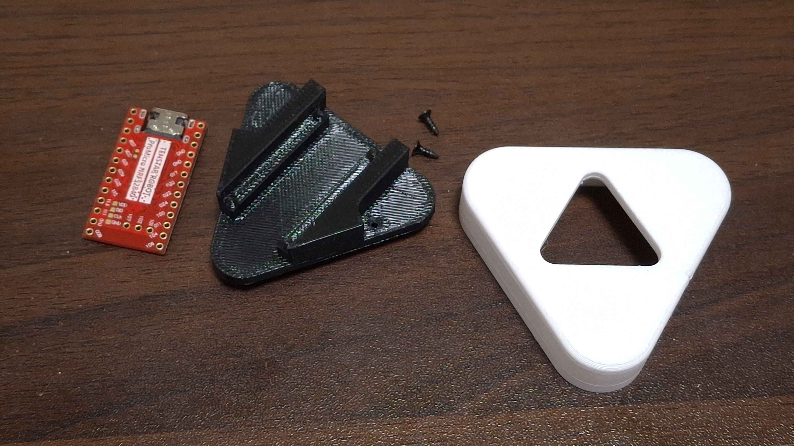
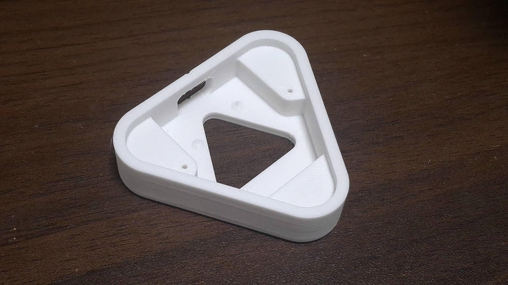
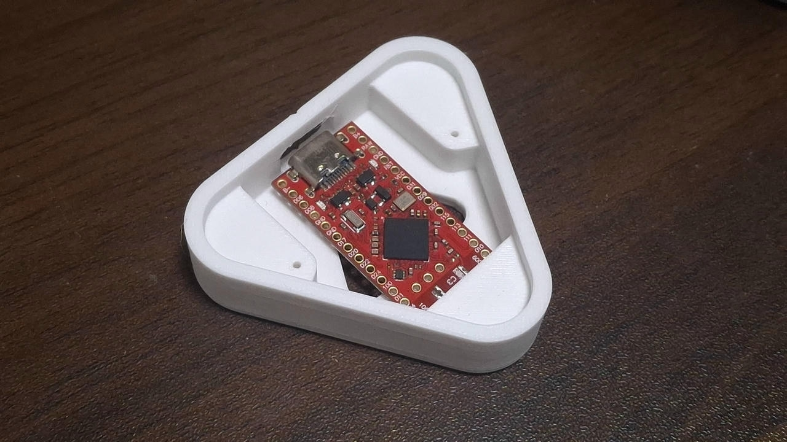
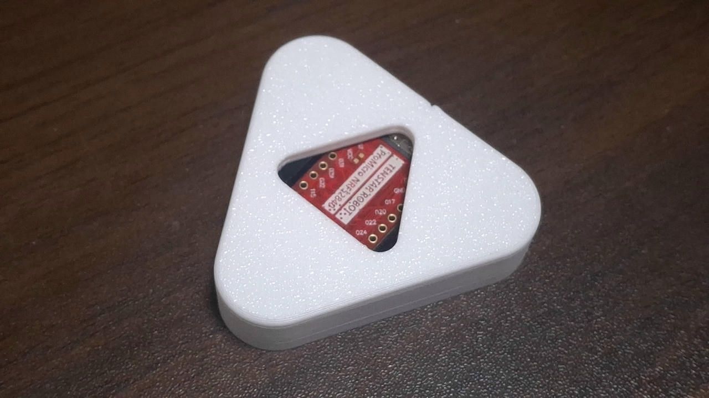

# Dongle Build Guide
This is a short build guide for yuwol dongle case.

## Preparation
You need a promicro with a wireless chipset, a top case, a bottom case, two screws/bolts, and optionally three bumpons.

## Build
First, flip the top case and look inside.

Inside you can see two asymetric bumps. Place the promicro's gnd pins over the bumps, with the component side up.

Put the bottom case over it carefully and fasten the screws/bolts.

Add the bumpons, and flip it.

